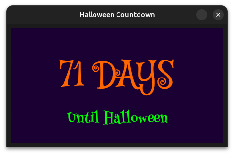

# Halloween Countdown 🎃

A spooky Halloween countdown application that displays the number of days until Halloween in decorative fonts.



## Features

- **Live Countdown**: Shows days remaining until Halloween (October 31st)
- **Special Halloween Message**: Displays "TODAY is Halloween!" on October 31st
- **Spooky Fonts**: 
  - Mystery Quest font for the countdown numbers
  - Henny Penny font for the subtitle text
- **Auto-refresh**: Updates every 60 seconds, even when running in the background
- **Dark Theme**: Purple background for that Halloween atmosphere
- **Fixed Window Size**: Non-resizable 450x250 pixel window
- **Cross-platform**: Runs on Linux, MacOS, and Windows

## Building

### Prerequisites

- Rust toolchain (install from [rustup.rs](https://rustup.rs/))

### Build

```bash
cargo build --release
```

The executable will be at `target/release/halloween-countdown`

## Running

```bash
cargo run --release
```

Or run the compiled binary directly:
```bash
./target/release/halloween-countdown
```

## Font Credits

- Mystery Quest font - Used for countdown display
  Copyright (c) 2012, Font Diner (www.fontdiner.com), with Reserved Font Name "Mystery Quest".
  This Font Software is licensed under the [SIL Open Font License, Version 1.1](https://openfontlicense.org/open-font-license-official-text/). 
- Henny Penny font - Used for subtitle text
  Copyright (c) 2011, BrownFox (gayaneh.b@gmail.com|www.brownfox.org), with Reserved Font Names "Henny Penny" 
  This Font Software is licensed under the [SIL Open Font License, Version 1.1](https://openfontlicense.org/open-font-license-official-text/). 

## License

MIT License - Copyright (c) 2025 Andrew C. Young <andrew@vaelen.org>

See the [LICENSE](LICENSE) file for details.

## Technical Details

- Built with Rust and egui/eframe
